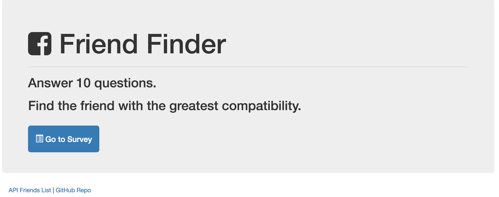

# Friend Finder

Friend Finder is a app that asks the user 10 questions and uses an algorithim to calculate the best match for the user.

The app uses the node.js runtime environment and the express web framework. The code shows how to use REST API procedures, API and HTML routes, and how to properly structure a development project.

The app is deployed to heroku at: [Friend Finder](https://shrouded-atoll-44741.herokuapp.com/)

